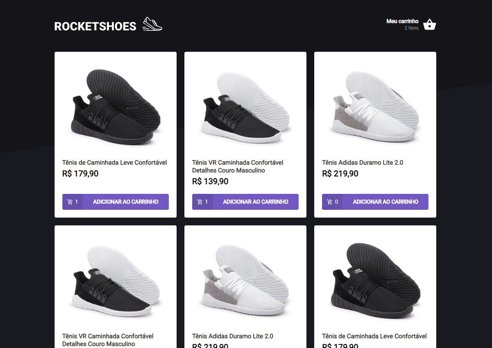

# RocketShoes


## :rocket: Sobre

# Objetivo do projeto
Nesse desafio, você deverá criar um hook para gerenciar um carrinho de compras.

## :books: Guia de instalação e execução

### Pré-requisitos

- [Git](https://git-scm.com/)
- [Node.js](https://nodejs.org/en/) v10.20 ou maior
- [Yarn](https://yarnpkg.com/)

### Como executar

- Clone este repositório ```git clone https://github.com/pedropaulodf/ignite-chapter2-desafio-principal.git```
- Entre no diretório com ```cd ignite-chapter2-desafio-principal```
- Execute ```yarn``` para instalar as dependências
- Execute ```yarn start``` para rodar a aplicação
- Em outro terminal, execute ```yarn dev``` para executar a simulação de uma API com o json-server

Pronto! Você pode visualizar o Rocketshoes através do endereço http://localhost:3000
